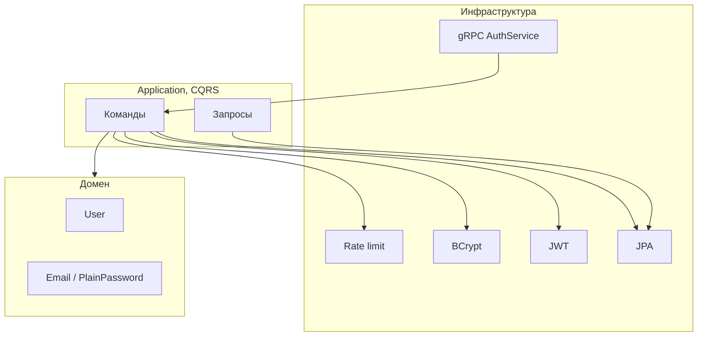

# Orbitto Auth — решение челленджа

Тут лежит backend для **регистрации**, **логина** (JWT access + refresh с ротацией) и **сброса пароля** (запрос + подтверждение токеном). Фронт по [Figma](https://www.figma.com/design/31KetUbya482vMSGgyiNIf/Orbitto-%7C-Service--Copy-?node-id=102-12806&t=TMlkJ3c3j3vJF5fb-4) сюда не тащил, тк я бэкендер — только сервис.

## Почему такой стек

| Что взял | Зачем |
|----------|--------|
| **Java 21** | LTS, нормальная скорость, привычно в «корпоративных» командах. |
| **Spring Boot 3.3** | JPA, Flyway, Actuator/Micrometer без велосипедов. |
| **gRPC + Protobuf** | По условию; контракт явный, `v1` можно эволюционировать. |
| **PostgreSQL** | Пользователи и opaque-токены, `uuid-ossp` для UUID. |

**Что рассматривал, но не выбрал:** Kotlin/Ktor (меньше готовой связки с JPA за разумное время), GraphQL (для auth-команд многовато), чистый Keycloak без своего домена (по заданию).

Чуть подробнее про решение — в [ADR 0001](docs/adr/0001-java-grpc-spring.md).

## Как поднять

### Docker Compose

```bash
docker compose up --build
```

- gRPC: `localhost:9090`
- HTTP / Actuator: `localhost:8080`, метрики: `http://localhost:8080/actuator/prometheus`

`JWT_SECRET` можно переопределить через env; в compose для локалки уже что-то стоит — в бою лучше своя длинная случайная строка.

### Локально без Docker

1. Поднять PostgreSQL 16+ и базу `orbitto_auth` (логин/пароль как в `application.yml` или свои).
2. Собрать и запустить:

```bash
./mvnw.cmd clean package -DskipTests   # Windows, wrapper уже в репо
mvn clean package -DskipTests          # если Maven стоит в PATH
java -jar target/auth-service-*.jar
```

На Винде, если сборка grpc-классов падает с ошибкой записи в `target/` — сделать `mvn clean` и повториь (иногда упираются в длину путей).

## Пощупать gRPC

```bash
grpcurl -plaintext -d "{\"email\":\"user@example.com\",\"password\":\"mysecret123\"}" localhost:9090 auth.v1.AuthService/Register
grpcurl -plaintext -d "{\"email\":\"user@example.com\",\"password\":\"mysecret123\"}" localhost:9090 auth.v1.AuthService/Login
```

Лимит на регистрацию считается по «ключу клиента»: берём первый hop из `x-forwarded-for` или адрес транспорта — при необходимости заголовок можно передать явно.

## Как устроено



**DDD:** контекст *Identity & Access*, агрегат `User`, value objects `Email`, `PlainPassword` (на входе, в БД не кладём), `PasswordHash`. Ошибки домена — `DomainException` с кодами; на границе gRPC маппятся в `Status`.

**CQRS:** отдельные handlers на команды + тонкий `UserByEmailQuery` для чтения. Read-модель отдельно не вводил — одна БД, осознанно упростил.

**IaC:** основной стенд — `docker-compose.yml` + `Dockerfile`. В `terraform/main.tf` — сеть/том/postgres под Docker-провайдер; контейнер приложения закомментирован, чтобы не плодить второй «источник правды» без собранного образа.

## Правила и инварианты

| Тема | Как сделано                                                                                                                          |
|------|--------------------------------------------------------------------------------------------------------------------------------------|
| Пароль при регистрации | ≥10 символов, есть буква и цифра.                                                                                                    |
| Пароль при логине | Только проверка BCrypt, без тех же правил длины/сложности (старые/странные пароли не отрежу по валидации).                           |
| Хранение | Пароль — BCrypt (12). Refresh и reset в БД — только SHA-256 от opaque-строки.                                                        |
| Refresh | Ротация в одном `family_id`; повторно сунуть уже заменённый токен → считаем компрометацией, рвём всё семейство.                      |
| Reset | Один актуальный запрос на пользователя; ответ «всё ок» даже если email не найден — без перебора аккаунтов.                           |
| Rate limit | Логин по email, регистрация по клиентскому ключу, reset по email. Сейчас in-memory (Bucket4j + Caffeine); в кластере логичнее Redis. |

## Наблюдаемость

- Логи через SLF4J; в dev токен сброса попадает в лог — в проде заменить на почту/очередь.
- Метрики: Micrometer → `/actuator/prometheus` (регистрации, логин, refresh, подтверждение reset).

## Тесты

```bash
./mvnw.cmd test
```

Есть юниты на домен, моки на handlers, интеграция `AuthStackIntegrationTest` на Testcontainers — **запускается только если Docker доступен** (`disabledWithoutDocker`).

## Компромиссы

1. Одна БД на чтение и запись — быстрее для челленджа; под нагрузкой — replica или отдельный read-path.
2. Rate limit в памяти — не шарится между инстансами.
3. JWT HS256 из конфига — для серьёзного prod чаще RS256 / OIDC и секреты из KMS/Vault.
4. Жёсткая реакция на reuse refresh может задеь двух честных клиентов в гонке — сознательно в пользу безопасности; можно усложнять идемпотентностью.

## Что бы докрутил под прод

- Реальная доставка ссылки сброса, без логирования секрета.
- Redis под лимиты и при желании blacklist сессий.
- OpenTelemetry + нормальные структурные логи с trace id.
- Политика паролей посильнее, MFA.
- gRPC reflection, контрактные тесты proto, аккуратные несовместимые изменения в `v2`.

---